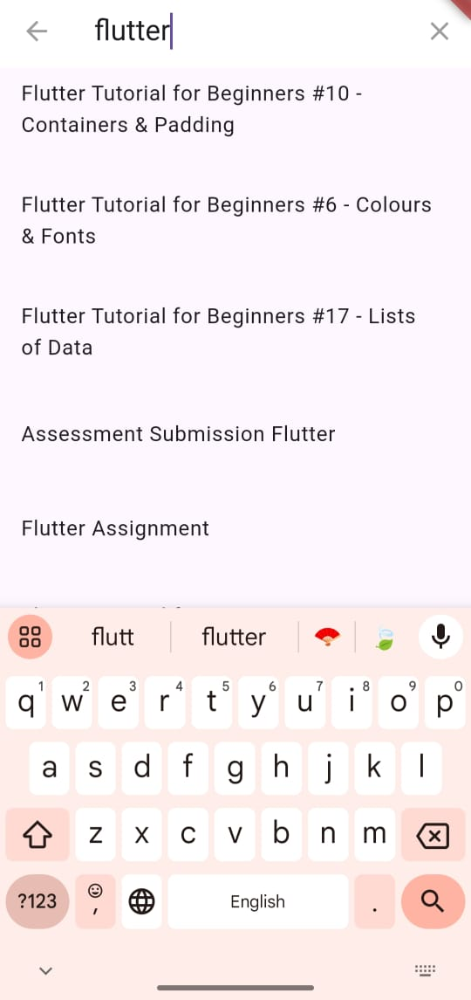

# Blog Explorer

Blog Explorer is a minimalistic Flutter app designed to help users explore and read blogs. The app features a clean and intuitive interface, allowing users to browse blogs by categories, search for specific blogs, and read detailed blog posts.

## Features

- **Browse Blogs**: Explore blogs by categories such as All, Merchants, Business, and Tutorial.
- **Search Functionality**: Quickly find blogs using the search feature.
- **Blog Details**: View detailed information about each blog, including title, image, and description.
- **State Management**: Utilizes the BLoC pattern for efficient state management.
- **Dark Mode**: Supports dark mode for a comfortable reading experience in low light conditions.

## Screenshots




## Installation

1. **Clone the repository**:
    ```bash
    git clone https://github.com/himanshu-raj-01/blog_explorer.git
    cd blog_explorer
    ```

2. **Install dependencies**:
    ```bash
    flutter pub get
    ```

3. **Run the app**:
    ```bash
    flutter run
    ```

## Usage

1. **Browse Blogs**: Open the app and browse blogs by selecting different categories from the tab bar.
2. **Search Blogs**: Use the search icon in the app bar to search for specific blogs.
3. **Read Blogs**: Tap on a blog to view its details.

## Configuration

- **API Endpoint**: The app fetches blogs from a REST API. Ensure the API endpoint and admin secret are correctly configured in the `blog_bloc.dart` file.


## Acknowledgments

- Thanks to the Flutter community for their support and contributions.


